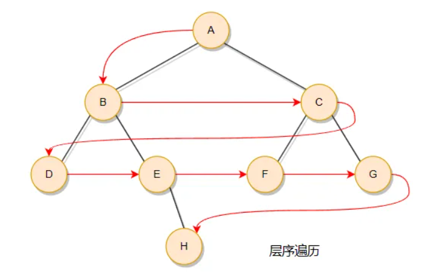

提示：不要选择递归方式去实现，而是学习非递归方式去实现（面试大概率考察这个）

```c++
class Solution {
public:
    vector<vector<int>> levelOrder(TreeNode* root) {
        vector<vector<int>> data;

        if(root == nullptr){return data;}   // 确保至少一个节点，后序代码不会对队列中的节点进行盼空

        queue<TreeNode*> qe;
        qe.push(root);

        while(!qe.empty()){
            auto curLevelNodes = qe.size();	// 当前层的节点个数，可与即将加入的下一层节点不混淆

            vector<int> curLevelData;
            for(int i = 0; i < curLevelNodes; i++){
                auto node = qe.front();qe.pop();
                curLevelData.push_back(node->val);
                if(node->left) qe.push(node->left);
                if(node->right) qe.push(node->right);
            }

            data.push_back(curLevelData);
        }

        return data;
    }
};
```

这道题有难度的地方是要对层序遍历的元素进行分组，而不是一股脑的把访问的元素按照层序遍历的顺序放到数组中返回。

一层中的节点属于一组，那就需要在一次循环中把这一层的元素放在一维数组里面，同时有需要把当前节点的左右子节点加入队列用于下次访问（如果左右节点存在）。

但是这里有个问题需要解决，当前阶段的节点和下一阶段的节点放在同一个队列中，你怎么弄清楚哪些是哪个层的？

当我们一开始处理当前层的节点的时候，队列元素的大小就是当前层的节点个数 ，也就能够不把当前层节点和后续加入队列的下一层的节点混淆了。



