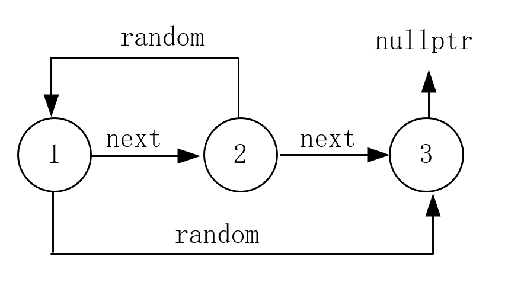

提示：哈希表

```c++
class Solution {
public:
    Node* copyRandomList(Node* head) {
        if (head == nullptr)
            return head;

        unordered_map<Node*, Node*> mp;

        auto cur_node = head;
        while (cur_node) {	
            mp[cur_node] = new Node(cur_node->val);
            cur_node = cur_node->next;
        }	// 哈希表构建完成

        cur_node = head;
        while (cur_node) {
            mp[cur_node]->next = mp[cur_node->next];
            auto node = cur_node->random;
            mp[cur_node]->random = node ? mp[cur_node->random] : nullptr;

            cur_node = cur_node->next;
        }	// 完成信息填充，这块对照画图来完成即可，不要忘记考虑 random 指向的是不是空节点

        return mp[head];
    }
};
```

题目说深拷贝，所有实际的节点需要自行分配内存，并把这些新建的节点串起来。



需要先把所有节点创建出来，再根据原信息建立这些节点信息。只要拿到原节点信息，自然就知道 next 和 random 信息。

我们创建的哈希表，key 为 原节点，value 为 新节点。

