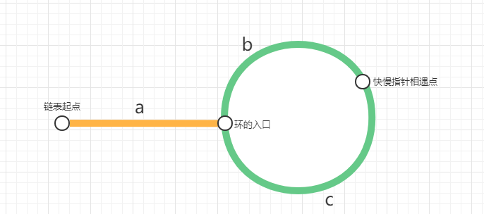

提示：

```c++
class Solution {
public:
    ListNode *detectCycle(ListNode *head) {
        if (!head || !head->next) return nullptr;

        ListNode* slow = head;
        ListNode* fast = head;

        // Step 1: 判环（快慢指针）
        while (fast && fast->next) {
            slow = slow->next;
            fast = fast->next->next;

            if (slow == fast) {
                // Step 2: 找环起点
                slow = head;
                while (slow != fast) {
                    slow = slow->next;
                    fast = fast->next;
                }
                return slow;
            }
        }

        return nullptr;  // 无环
    }
};
```

## 如何判断环的？

慢指针每次走一步，快指针每次走两步。

如果链表中有环，`fast` 会因为比 `slow` 走得快，**最终在环中追上 `slow`**。

如果链表无环，`fast` 会先走到 `nullptr`，结束遍历。

## 如何找到环的入口的？



快指针走的距离是慢指针的两倍，有如下推导：

```c++
a + b + nr = 2(a + b)  （n 是快指针绕了几圈）
    
推导得：a = nr - b
```

从 `head` 到环起点的距离 `a`，从相遇点再走 `nr - b` 步也会到环起点。

所以，从链表头部出发的指针，和从相遇点出发的指针，每次走一步，最终将在环起点汇合！

