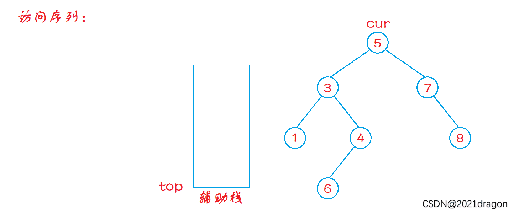

提示：不要选择递归方式去实现，而是学习非递归方式去实现（面试大概率考察这个）

```c++
class Solution {
public:
    vector<int> preorderTraversal(TreeNode* root) {
        vector<int> data;
        auto cur = root;
        stack<TreeNode*> sk;
        while (cur || !sk.empty()) {
            while (cur) {
                sk.push(cur);
                data.push_back(cur->val);
                cur = cur->left;
            }

            while (!sk.empty()) {
                auto node = sk.top();
                sk.pop();
                if (node->right) {
                    cur = node->right;
                    break;
                }
            }
        }
        return data;
    }
};
```

思路：

1. 一路向左走，同时把走过的节点压栈并立刻**访问**（因为是前序）；
2. 左边到底后，通过栈回退；
3. 若当前节点有右子树，则转向右子树，重新执行左侧流程；
4. 否则继续弹栈。



前序遍历会先把根节点的值记录到数组中，又必须从根节点开始访问。

如果这个时候不把节点的值记录下来，后面由于栈的特点可能就无法正确记录，故每次访问到节点就是要把对应的值加入到数组中记录下来。