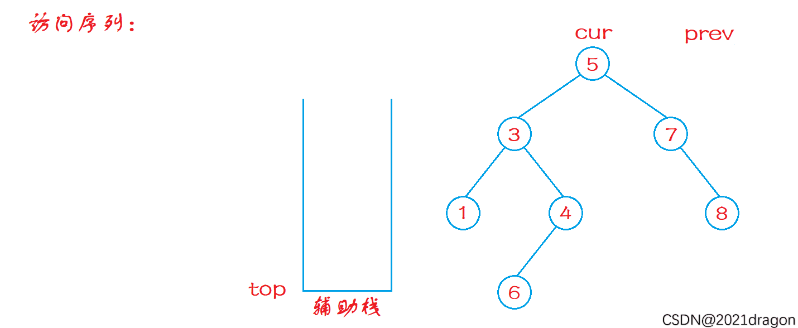

提示：不要选择递归方式去实现，而是学习非递归方式去实现（面试大概率考察这个）

```c++
class Solution {
public:
    vector<int> postorderTraversal(TreeNode* root) {
        vector<int> data;
        auto cur = root;
        stack<TreeNode*> sk;

        TreeNode* vistedPrev = nullptr;
        while (cur || !sk.empty()) {
            while (cur) {
                sk.push(cur);
                cur = cur->left;
            }

            while (!sk.empty()) {
                auto node = sk.top();
                if (node->right && node->right != vistedPrev) {
                    cur = node->right;
                    break;
                }
                data.push_back(node->val);
                sk.pop();
                vistedPrev = node;
            }
        }

        return data;
    }
};
```

1. cur 不为空，走到最左，依次入栈；
2. 取栈顶，如果当前节点存在右节点，且和前一个记录的节点 vistedPrev  不相等，那就要进入下一轮循环，保证左节点始终最先进入数组；否则当前节点不存在右节点或者当前节点和节点 vistedPrev  相等，就把当前节点记录到数组中，并且更新 vistedPrev 。
3. 用 vistedPrev 标记上次访问的节点。



后序遍历显然是左子树最先被加入到数组中，因此必然是持续遍历左节点，直到 nullptr。

然后就是访问到根节点，但是不立即处理，而是看看是不是有右节点，如果有的话就得进入下一次循环中，保证左节点依旧最先加入数组中。其次才是把右节点加入到数组中。

等到最后，才处理中间节点。但是要特别注意，如果直接就对中间节点进行访问，而不进行任何判断，就会进入死循环。因为左右节点已经访问过，不进行任何判断，那么中间节点会因为再次访问到右节点而进入死循环。

因此，我们需要记录前一个节点的信息，这个前一个节点在栈中就对应中间节点的右节点，判断条件就如下：

```c++
if (node->right && node->right != vistedPrev) {
	cur = node->right;
	break;
}
```
