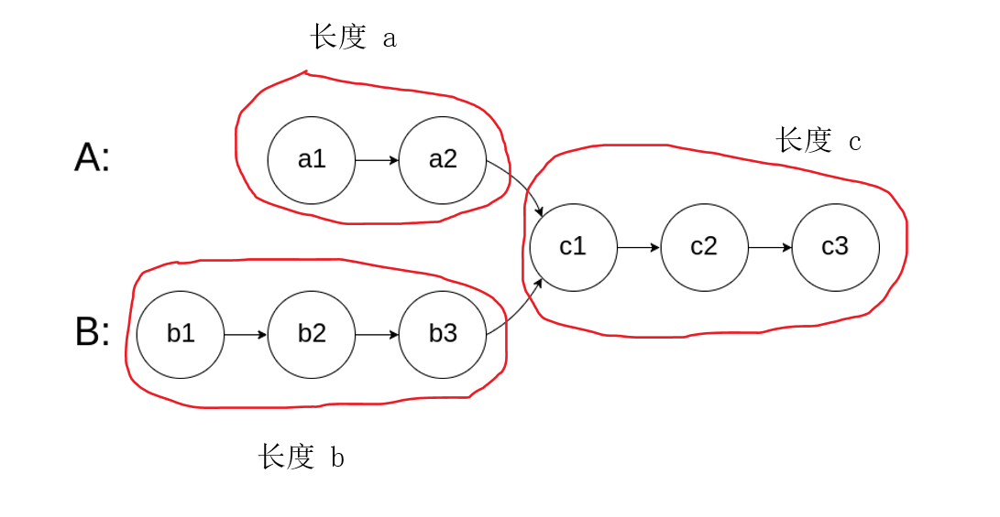

提示：节点相同，代表节点的地址相同，而不是节点存储的值相同

```c++
class Solution {
public:
    ListNode* getIntersectionNode(ListNode* headA, ListNode* headB) {
        // 求链表长度之差 A，让最长的链表先移动 A 步
        int Alen = 0, Blen = 0;
        auto hA = headA, hB = headB;
        while (hA) {
            Alen++;
            hA = hA->next;
        }
        while (hB) {
            Blen++;
            hB = hB->next;
        }
        auto distance = abs(Alen - Blen);

        // 确保 headA 是最长的链表
        if (Blen > Alen) {
            swap(headA, headB);
        }

        // 移动 distance 距离
        while(distance--){
            headA = headA->next;
        }

        // 开始遍历，节点地址相同就返回该节点

        while (headA && headB) {
            if (headA == headB) {
                return headA;
            }
            headA = headA->next;
            headB = headB->next;
        }

        return nullptr;
    }
};
```

&nbsp;

从网上有看到双指针的做法，代码非常简洁，把思路学习一下：

1. 两个指针分别从 `headA` 和 `headB` 出发。
2. 遍历到末尾后换到另一个链表头部，最终两个指针会在交点相遇，或者都指向 `nullptr`。
3. 本质是让两个指针走相同的长度（`a + c + b = b + c + a`，其中 `c` 是公共部分长度）。



如果存在相交部分（即 `c > 0`），两个指针一定会在 **第一个相交节点**同步相遇，就会结束循环。

如果没有相交（即 `c = 0`），两个指针都会在同一时刻变成 `nullptr`，表示不相交。

```c++
class Solution {
public:
    ListNode *getIntersectionNode(ListNode *headA, ListNode *headB) {
        if (!headA || !headB) return nullptr;

        ListNode* p1 = headA;
        ListNode* p2 = headB;

        while (p1 != p2) {	// 相等不一定是存在交点，但是相等必须停止循环
            p1 = p1 ? p1->next : headB;
            p2 = p2 ? p2->next : headA;
        }

        return p1; // 可能是相交节点，也可能是 nullptr
    }
};

```

