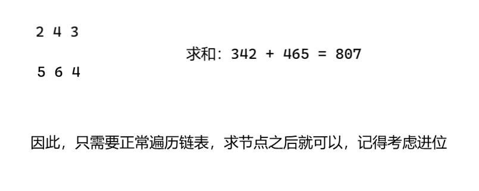

提示：本意是要求你**模拟大数加法**

```c++
class Solution {
public:
    void update(int& sum, int& prev) {
        if (sum >= 10) { // 题目确保只是单个数的相加
            prev = 1;
            sum = sum - 10;
        } else {
            prev = 0;
        }
    }
    ListNode* addTwoNumbers(ListNode* l1, ListNode* l2) {
        auto virtual_head = new ListNode(-1);
        auto record = virtual_head;
        int carry = 0;
        while (l1 || l2 || carry) {
            int n1 = l1 ? l1->val : 0;
            int n2 = l2 ? l2->val : 0;

            if (l1) l1 = l1->next;
            if (l2) l2 = l2->next;

            int sum = n1 + n2 + carry;
            update(sum, carry);
            auto node = new ListNode(sum);
            record->next = node;

            record = record->next;
        }
        return virtual_head->next;
    }
};
```

先读懂题意：



巧妙的设计：

1. 虚拟头结点：设计一个虚拟头结点，方便链表的操作，也很容易返回真正的头结点
2. 不是通过 &&  而是通过 || 判断：`while (l1 || l2 || carry)` ，就只需要在 while 循环中处理就可以，而不需要在离开循环之后还要额外的考虑其他问题。如果我们是通过 && 来判断，离开 while 还要考虑如下问题：
   1. 不知道 l1 和 l2 哪个先遍历完成，得再写两个 while 循环
   2. 还得额外考虑 carry 进位