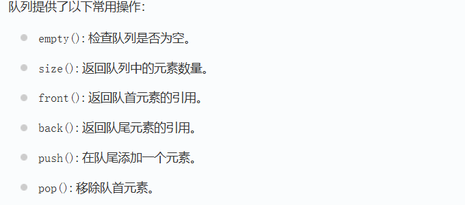

提示：双队列实现

```c++
class MyStack {
 public:
  MyStack() {

  }

  void push(int x) {
	  tail.push(x);
  }

  int pop() {
	  if (tail.empty()) swap(tail, head);

	  while (tail.size() != 1) {
		  head.push(tail.front());
		  tail.pop();
	  }

	  auto val = tail.front();
	  tail.pop();
	  return val;
  }

  int top() {
	  if (!tail.empty()) {
		  return tail.back();
	  }
	  return head.back();
  }

  bool empty() {
	  return head.empty() && tail.empty();
  }
  
 private:
  queue<int> head;
  queue<int> tail;
};

```

元素插入到 tail 中，head 作为其他接口的中转站。

top 获取顶端元素，优先看 tail ，如果有就返回 back 尾元素，否则返回 head 的 back 尾元素。

pop 要弹出栈顶元素，如果 tail 是空的，表明元素在 head 中，把两个进行交换，保证 tail 中是有元素的。然后就开始把 tail 中的元素部分移动到 head 中，即最后一个元素不移动。用于返回并且模拟栈顶弹出。

pop 中之所以前面要进行交换，是为了逻辑上不做多余的考虑，因为元素是插入到 tail 中的，如果 tail 中 有元素，那就要把 tail 中的元素部分移动到 head 中，即最后一个元素不移动。为了复用前面的这个代码逻辑，如果 tail 是空的，就 swap 两个队列。

&nbsp;

操作：

