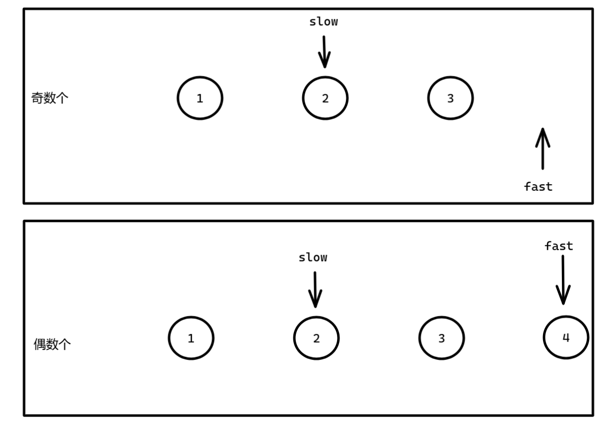

提示：

```c++
class Solution {
public:
    bool isPalindrome(ListNode* head) {
        if (!head || !head->next) return true;

        // Step 1: 找中点（slow 最终指向中间节点）
        ListNode* slow = head;
        ListNode* fast = head;
        while (fast->next && fast->next->next) {
            slow = slow->next;
            fast = fast->next->next;
        }

        // Step 2: 反转后半部分链表
        ListNode* secondHalf = reverseList(slow->next);

        // Step 3: 比较左右两部分
        ListNode* p1 = head;
        ListNode* p2 = secondHalf;
        bool is_palindrome = true;

        while (p2) {
            if (p1->val != p2->val) {
                is_palindrome = false;
                break;
            }
            p1 = p1->next;
            p2 = p2->next;
        }

        // Step 4: 恢复链表（可选）
        slow->next = reverseList(secondHalf);

        return is_palindrome;
    }

private:
    ListNode* reverseList(ListNode* head) {
        ListNode* prev = nullptr;
        while (head) {
            ListNode* next = head->next;
            head->next = prev;
            prev = head;
            head = next;
        }
        return prev;
    }
};

```

利用快慢指针找到中间节点，最后慢指针（slow）指向的就是中间节点：



然后就可以把 slow 节点后面的链表进行反转，就可以考虑遍历两个链表。

结合上图可知，前部分链表 A 的长度 >= 后部分链表 B 的长度。因此，我们选择遍历 B ，而不是遍历 A 。

如果在同时前进的过程中，发现两个的值不相等，就返回 false。否则退出循环，就返回 true。