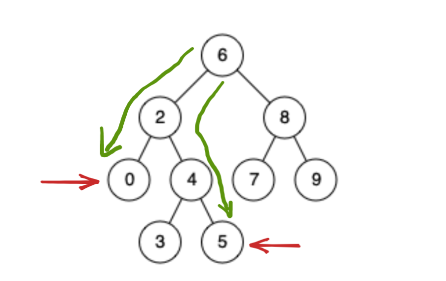

提示：用栈记录从根节点到目标节点的路径，通过弹出操作保证两边元素个数相同，让后开始回退知道两边的节点相等，那就找到公共祖先了。

```c++
class Solution {
 public:

  stack<TreeNode *> search(TreeNode *root, TreeNode *target) {
	  auto cur = root;
	  auto val = target->val;
	  stack<TreeNode *> sk;
	  while (cur != nullptr) {
		  auto cur_val = cur->val;
		  sk.push(cur);
		  if (val < cur_val) {
			  cur = cur->left;
		  } else if (val > cur_val) {
			  cur = cur->right;
		  } else {
			  break;
		  }
	  }
	  return sk;
  }

  TreeNode *lowestCommonAncestor(TreeNode *root, TreeNode *p, TreeNode *q) {
      // 记录从根节点到目标节点的路径
	  auto sk_p = search(root, p);
	  auto sk_q = search(root, q);

	  if (sk_p.size() > sk_q.size()) {
		  swap(sk_q, sk_p);
	  }    // 确保 sk_q 长度是最最大的（你可以任意选择，反正保证两边的元素个数相同）
	  auto size = sk_q.size() - sk_p.size();
	  for (int i = 0; i < size; ++i) {
		  sk_q.pop();
	  }

	  TreeNode *target = nullptr;
	  while (!sk_q.empty() && !sk_p.empty()) {
		  if (sk_q.top() == sk_p.top()) {
			  target = sk_q.top();
			  break;
		  } else {
			  sk_q.pop();
			  sk_p.pop();
		  }
	  }
	  return target;
  }
};
```

示意图：



目标节点 0 记录的路径：0 2 6

目标节点 5 记录的路径：5 4 2 6

保证两边的元素个数相同，弹出对应数量的元素，更新结果如下：

目标节点 0 记录的路径：0 2 6

目标节点 5 记录的路径：4 2 6

此刻，开始回退（利用栈的特点），如果回退过程中发现两个节点相等，那就是它们的公共祖先。