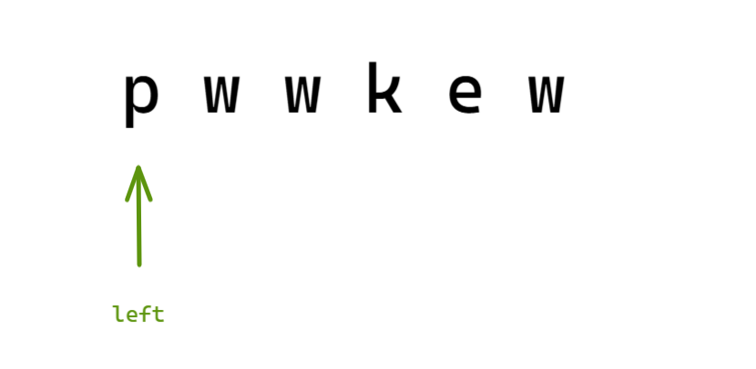
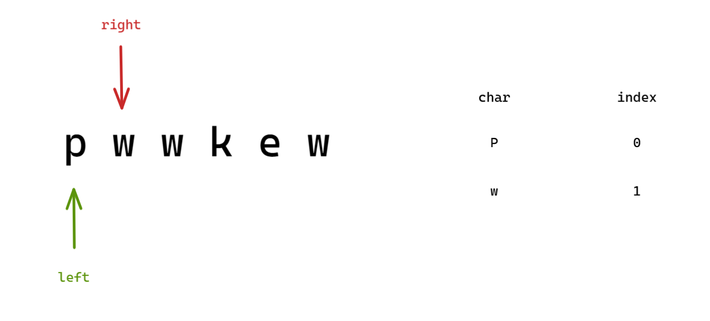
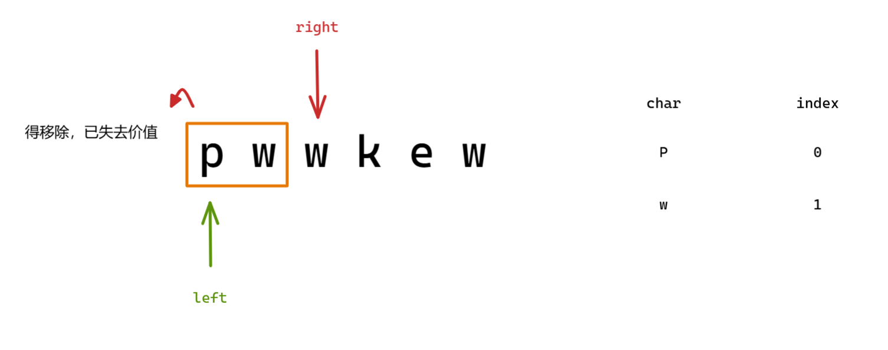
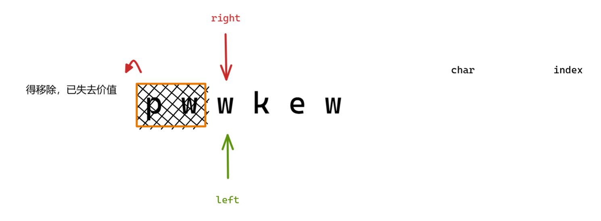

提示：遇到重复的字符出现，那么该字符及其以前的字符都失去价值

```c++
class Solution {
public:
    int lengthOfLongestSubstring(string s) {

        unordered_map<char, int> mp;
        int max_len = 0;

        int left = 0;
        for (int right = 0; right < s.size(); right++) {
            auto ch = s[right];
            auto it = mp.find(ch);
            if (it != mp.end()) {   // 出现重复字符
                int size = it->second;  
                for (int j = left; j <= size; j++) {    // 把重复字符及其以前的通通从 mp 中移除
                    mp.erase(s[j]);
                    left++;
                }
            }
            mp[s[right]] = right;   // 记录索引信息
            max_len = max(max_len, right - left + 1);   // 每次都计算当前的最大值
        }

        return max_len;
    }
};
```

初始状态：



开始遍历，前两个元素都没有出现重复字符：



继续遍历，遇到重复字符：



移除的字符范围就是：起始点为 left，终点为 前重复字符的下标（如图中的下标为 1 的 w）

因为 left 和 right 构成连续的字符串，题目要求不能有重复的字符，那不就是把这个重复字符（最先出现的字符）以及前面的字符都给删除吗？通过 更新 left 和 删除的字符从哈希表中删除对应的记录 实现删除这部分字符：



不管是什么时候（找或没找到重复字符），都会在后面添加当前字符的记录并且计算最大连续不重复子串的长度。