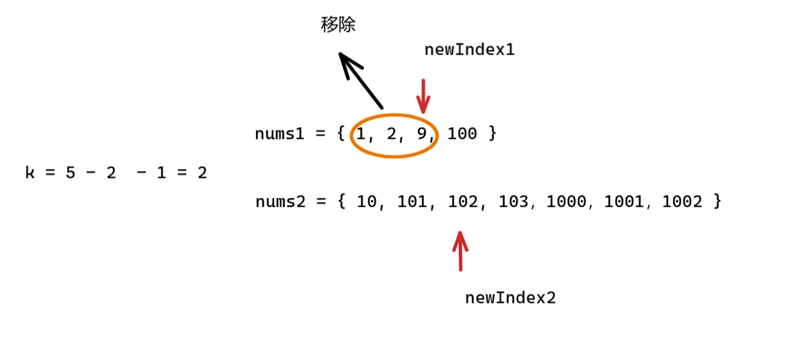

提示：将问题转换为求数组中 第 k 小的元素，用二分思想优化

```c++
class Solution {
public:
    double findMedianSortedArrays(vector<int>& nums1, vector<int>& nums2) {
        int totalLength = nums1.size() + nums2.size();
        if (totalLength % 2 == 1) {
            return getKthElement(nums1, nums2, (totalLength + 1) / 2);
        } else {
            int left = getKthElement(nums1, nums2, totalLength / 2);
            int right = getKthElement(nums1, nums2, totalLength / 2 + 1);
            return (left + right) / 2.0;
        }
    }

private:
    int getKthElement(const vector<int>& nums1, const vector<int>& nums2, int k) {
        int index1 = 0, index2 = 0;
        int m = nums1.size(), n = nums2.size();

        while (true) {
            // 边界情况
            if (index1 == m) return nums2[index2 + k - 1];
            if (index2 == n) return nums1[index1 + k - 1];
            if (k == 1) return min(nums1[index1], nums2[index2]);

            // 两个数组大小不一致，K 可能会非常大
            // 利用 min 来保证下标不会越界
            int newIndex1 = min(index1 + k / 2 - 1, m - 1);
            int newIndex2 = min(index2 + k / 2 - 1, n - 1);
            int pivot1 = nums1[newIndex1];
            int pivot2 = nums2[newIndex2];
		   // 将最小的一部分移除，距离目标就更近一步
            if (pivot1 <= pivot2) {
                k -= (newIndex1 - index1 + 1);
                index1 = newIndex1 + 1;
            } else {
                k -= (newIndex2 - index2 + 1);
                index2 = newIndex2 + 1;
            }
        }
    }
};

```

## 中位数有可能只在一个数组中存在，而另一个数组没有

来看这个极端情况：

```c++
nums1 = {1, 2, 3, 4, 5, 6}
nums2 = {1000, 1001}
```

合并后：

```c++
[1, 2, 3, 4, 5, 6, 1000, 1001]  // 共8个数
          ↑  ↑
      第4和第5个数是：4 和 5 （都在 nums1）
```

此时，**两个中位数都在 nums1**，nums2 只是一些非常大的“尾巴”，跟中位数无关。

故而，每次在求解中位数的时候，都得带上两个数组一起考虑，只考虑一个数组去查找中位数的情况是不合理的。

## 如果越界说明答案在另一个数组中

每次比较，都会把另一个数组中的部分元素移除，就像下面这样：



移除是通过自增 newIndex1 或者  newIndex2 来完成，那如果 newIndex1 或者  newIndex2 自增之后越界（前面保证没有自增的 newIndex1 或者  newIndex2 不会越界），表面答案肯定在 另一个数组中。

那能够快速知道答案在另一个数组的哪个位置吗？

我们现在还要找第 k 小的元素，只能在另一个数组中找，因此答案就是 当前有答案的数组的 index - k  + 1 就是目标元素的位置。

## 为什么 k = 1 的时候要去找答案了？

当我们说找第 k 小的元素的时候，k 不是下标，而是第几个。

如果 k = 0，那说明不用找，要么就是两个空数组，要么就是其中一个数组为空，另一个数组只有一个元素。这两种情况前面都已经处理。

如果 k = 1，表面前面小的元素已经被移除，只剩下原本要查找的第 k 小的元素。只是，我们不清楚到底是在数组 A ，还是在另一个数组 B，只需要比较两个数组有效元素的第一个下标元素大小就可以，小的就是要找的第 k 小的元素。

