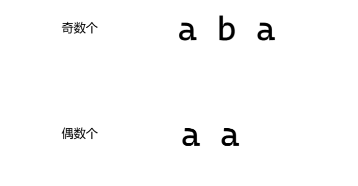
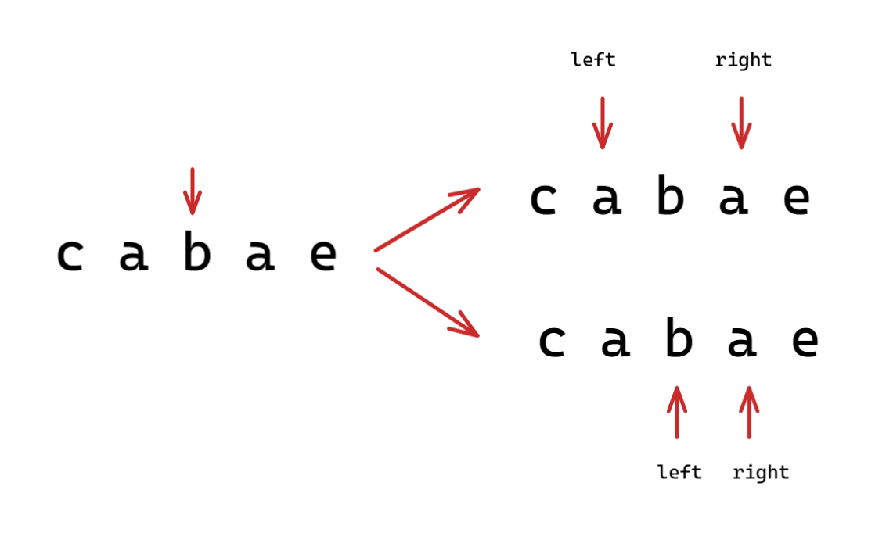
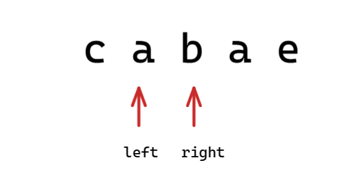

提示：选择下标，考虑两种回文字符串的形式，从两侧展开，求得最长回文子串

```c++
class Solution {
 public:
  string longestPalindrome(string s) {
	  // 求最大长度回文字符串，并且返回这个字符串

	  int start = 0, maxLen = 1;
	  for (int i = 0; i < s.size(); ++i) {
		  // 以 s[i] 为中心的回文字符串
		  tryGetMaxLen(s, i - 1, i + 1, start, maxLen);
		  // 以 s[i] 和 s[i+1] 为中心的回文字符串
		  tryGetMaxLen(s, i, i + 1, start, maxLen);
	  }
	  return s.substr(start, maxLen);
  }

 private:
  void tryGetMaxLen(const string &str, int left, int right, int &start, int &maxLen) {
	  while (left >= 0 && right < str.size()) {
		  if (str[left] != str[right]) {
			  break;
		  }
		  left--;
		  right++;
	  }
      // 确保 left 和 right 指向有效字符串的起始和末尾
	  left++;
	  right--;
      // 如果获得更长的回文子川，更新长度和起始位置
	  if (right - left + 1 > maxLen) {
		  maxLen = right - left + 1;
		  start = left;
	  }
  }
};
```

## 回文字符串的两种形式



## 为什么不用考虑左边的偶数个？

我们选择一个下标，并且向两侧展开：



但是，我们为什么不用考虑下面这种情况呢？



那是在前面我们选择 下标 1 作为展开点的时候，已经考虑过上面这种情况。

