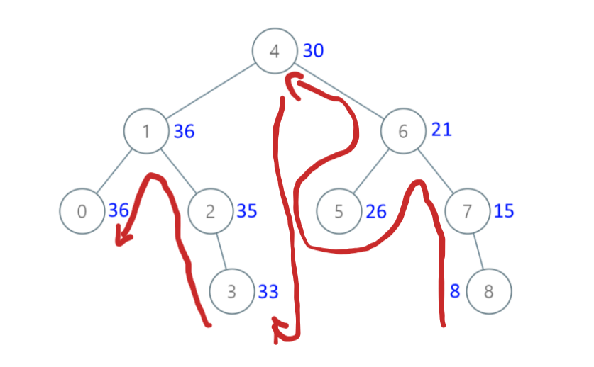

提示：可以推导如何遍历能够让累加的过程与题目保持一致，虽然二叉树遍历方式不一定立即符合要求，但稍微变化一下，比如这道题把收集的结果反转。

```c++
class Solution {
public:
    vector<TreeNode*> collect(TreeNode* root) {
        stack<TreeNode*> sk;
        vector<TreeNode*> result;
        auto cur = root;

        while (cur || !sk.empty()) {
            while (cur) {
                sk.push(cur);
                cur = cur->left;
            }

            while (!sk.empty()) {
                auto node = sk.top();
                sk.pop();
                result.push_back(node);
                if (node->right) {
                    cur = node->right;
                    break;
                }
            }
        }

        return result;
    }

    TreeNode* convertBST(TreeNode* root) {
        auto vec = collect(root);

        int sum = 0;
        for (auto i = vec.rbegin(); i != vec.rend(); ++i) {	// 反向遍历
            (*i)->val += sum;
            sum = (*i)->val;
        }
        return root;
    }
};
```

累加的顺序如下：



中序遍历收集节点到 result，返回反向遍历 result 求累加就可以。

