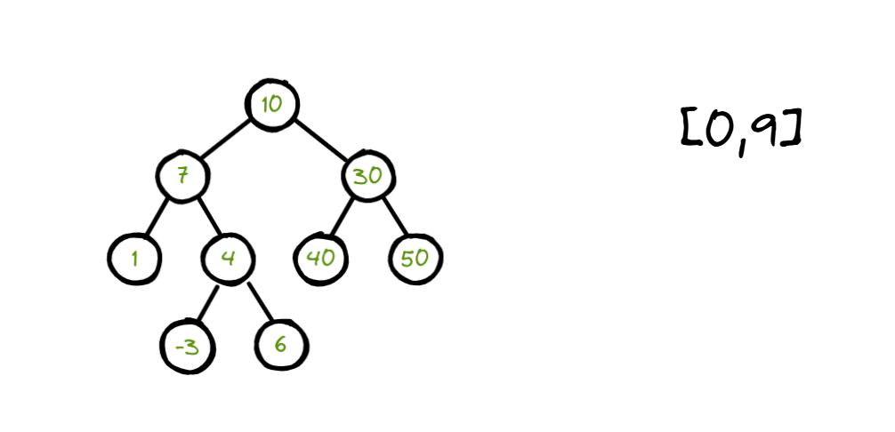
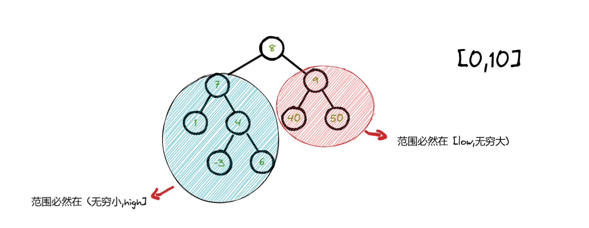
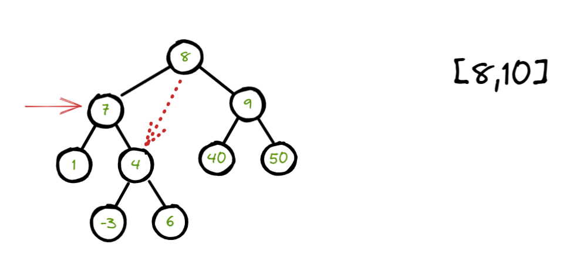
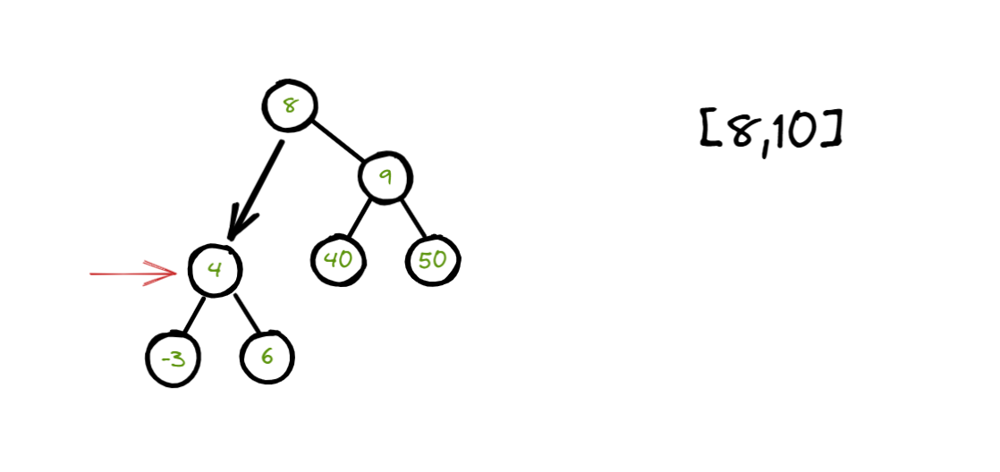

提示：见题解

```c++
class Solution {
 public:
  TreeNode *trimBST(TreeNode *root, int low, int high) {

	  while (root) {
		  auto val = root->val;
		  if (val < low) {
			  root = root->right;
		  } else if (val > high) {
			  root = root->left;
		  } else { break; }
	  }

	  if (root == nullptr) return root;

      // 移除左子树中不合法的节点
	  auto cur = root;
	  while (cur) {
		  while (cur->left && cur->left->val < low) {    // 不在区间内
			  cur->left = cur->left->right;
		  }
		  cur = cur->left;
	  }

      // 移除右子树中不合法的节点
	  cur = root;
	  while (cur && cur->right) {
		  while (cur->right && cur->right->val > high) {    // 不在区间内
			  cur->right = cur->right->left;
		  }
		  cur = cur->right;
	  }

	  return root;
  }
};
```

如果根节点就不在区间范围内：



如果 根节点的值大于 high，说明右子树及其根节点都要被抛弃，更新根节点为左子树；

如果 根节点的值小于 low，说明左子树及其根节点都要被抛弃，更新根节点为右子树；

如此循环，直到根节点在合法区间内。

&nbsp;

经过上面的处理，我们不能确保根节点是不是已经为空，因为可能最初的树所有节点都不合法。

因此，如果当前根节点是合法的，我们就可以继续往下处理，且保证当前根节点必然合法，并不用在后面的过程中被替换。

&nbsp;

在继续处理之前，我们来看下面这个示例，来得出一些结论：



既然根节点已经合法，那么根节点的左子树值的范围必然不可能大于 high，根节点的右子树值的范围必然不可能小于 low。

故而，在处理左子树的时候，不可能遇到大于 high 这种不合法的情况，只要遇到 小于 low 就视为不合法要去处理；在处理右子树的时候，不可能遇到小于 low 这种不合法的情况，只要遇到 大于 high 就视为不合法要去处理。

&nbsp;

处理左子树中不合法的节点：



节点 7 不合法，将其父亲节点（根节点） left 指向节点 7  的 右子树。这样就把 节点 7 已经对应的左子树移除。



继续循环判断，如果发现当前节点是合法的话，那就表明当前节点的右子树必然是合法的。因为右子树中的值必然大于当前节点，且小于等于 high。

但是当前节点的左子树合法与否并不确定，所以更新当前节点 cur = cur->left 继续处理。

&nbsp;

处理右子树中不合法的节点：

前面我们已经把根节点左子树中不合法的都移除，这里就要处理右子树了。

由于前面把左子树部分讲得很清楚，相应的结论都是对称的，这里就不多赘述了。