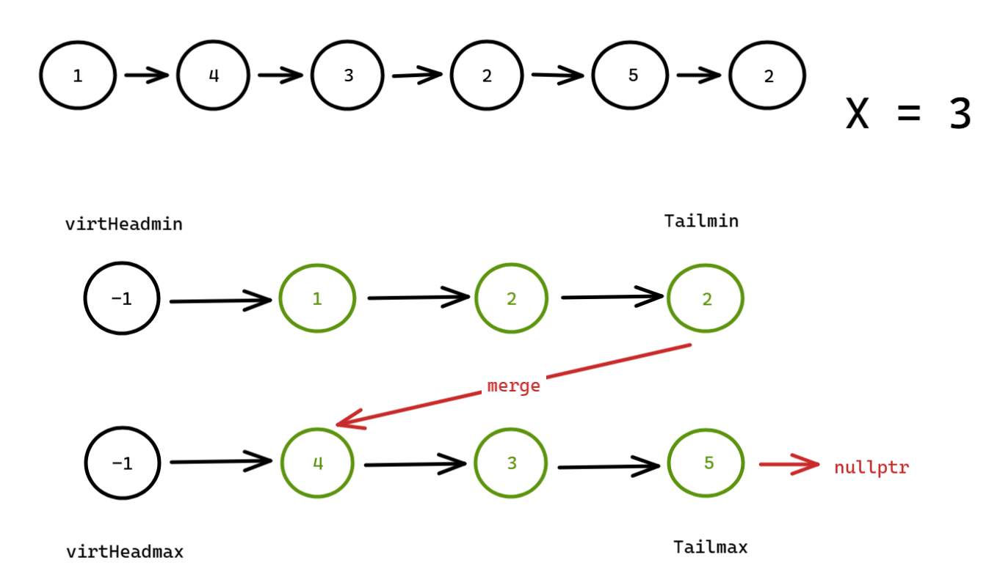

提示：单独创建两个链表，一个链表 A 记录小于 x 的节点，一个链表 B 记录 大于等于 x 的节点，最后 B 拼接到 A 后面。

```c++
class Solution {
public:
    ListNode* partition(ListNode* head, int x) {
        if(!head) return head;

        auto virtHeadmin = new ListNode(-1);
        auto Tailmin = virtHeadmin;

        auto virtHeadmax = new ListNode(-1);
        auto Tailmax = virtHeadmax;

        while (head) {
            if (head->val < x) {
                Tailmin->next = head;
                Tailmin = Tailmin->next;
            } else {
                Tailmax->next = head;
                Tailmax = Tailmax->next;
            }
            head = head->next;
        }

        // if (Tailmax == virtHeadmax) {
        //     return virtHeadmin->next;
        // }
        // if (Tailmin == virtHeadmin) {
        //     return virtHeadmax->next;
        // }

        Tailmin->next = virtHeadmax->next;
        Tailmax->next = nullptr;

        return virtHeadmin->next;
    }
};
```

示意图：



最初还考虑如果其中一方存储所有节点，另一方一个都没有存储，是否需要单独判断，对应上面注释掉的代码。

事实证明不需要，即便是那种情况，也可以被正确的处理。