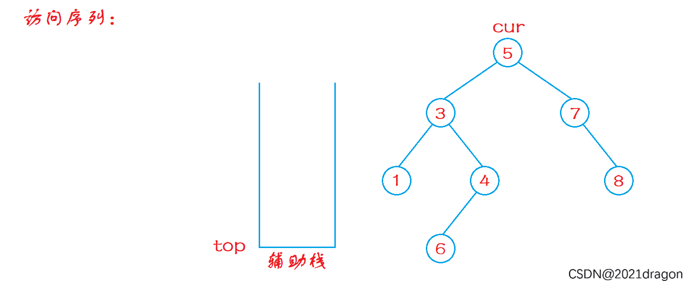

提示：不要选择递归方式去实现，而是学习非递归方式去实现（面试大概率考察这个）

```c++
class Solution {
public:
    vector<int> inorderTraversal(TreeNode* root) {
        vector<int> data;
        TreeNode* cur = root;
        stack<TreeNode*> sk;
        while (cur || !sk.empty()) {
            // 持续访问左节点，加入栈中，表明后面会去访问，直到 nullptr

            while (cur) {
                sk.push(cur);
                cur = cur->left;
            }

            // 开始访问节点，并且当前节点有右节点，必然是中间节点，需要持续探究其左节点（进入到下一轮循环）
            while (!sk.empty()) {
                auto node = sk.top();
                sk.pop();
                data.push_back(node->val);
                if (node->right) {
                    cur = node->right;
                    break;
                }
            }
        }

        return data;
    }
};
```

思路：

1. 先一路走到最左端，把路径节点都压栈；
2. 然后退栈**访问**（访问的是“根”）；
3. 如果当前节点有右子树，则转向右子树并重复走左过程。
4. 否则继续弹栈。




中序遍历，元素输出顺序首先是左边的部分 A，其次是 A 的父母节点，再是 A 的父母节点右边的部分 B。

我们希望 top 上面是 左边的部分 A，它压着的是 自己的父母节点。这个父母节点就可以访问到右边的部分 B，这个时候的 B 不是在栈中，而是通过刚刚从栈顶访问到的 父母节点 才访问到的。

一个元素要想被加入到输出顺序，**得先到栈中，再从栈中被访问的时候才可以加入到输出顺序**。